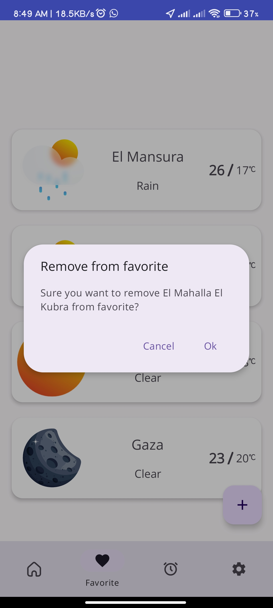
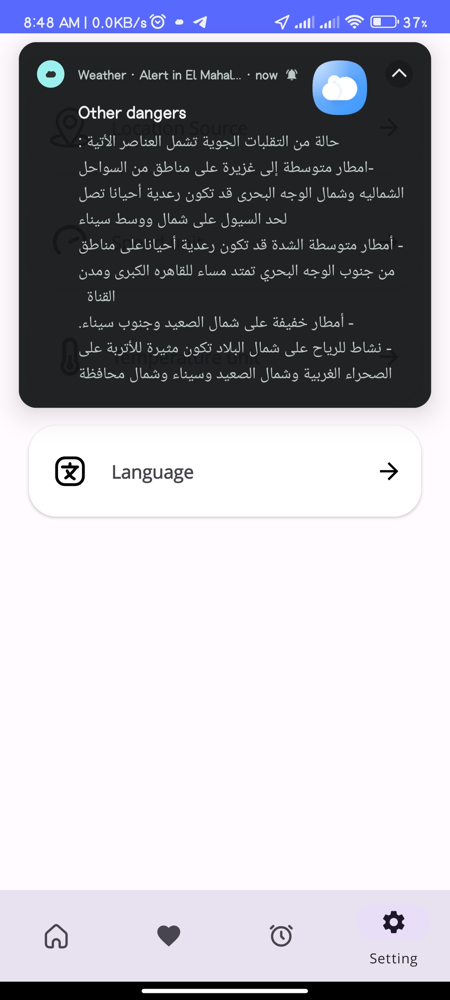

## Project Title: Weather Forecast App

### Description:
The Weather Forecast App is an Android mobile application designed to provide users with real-time weather information based on their location or any specific location they choose on the map. Users can also add cities to their list of favorites, set alerts for forecast events, and receive detailed weather updates.

### Technologies Used:
- **Kotlin:** The primary programming language used for Android app development.
- **MVVM (Model-View-ViewModel):** An architectural pattern to separate the application into three main components for better organization and testability.
- **LiveData:** Part of the Android Architecture Components, LiveData is used to observe data changes and update the UI accordingly.
- **Coroutines:** Used for asynchronous programming, making it easier to manage background tasks.
- **Android Jetpack Library:** A suite of libraries to help developers follow best practices and streamline the app development process.
- **OpenStreetMap:** Integration for displaying maps and selecting specific locations.
- **Room:** A persistence library to store and manage app data in a SQLite database.
- **Navigation:** Android's navigation component for handling navigation and UI-related actions.
- **Alarm Manager:** Used to schedule and manage alarms for forecast events and alerts.
- **Lottie Animation:** Utilized for adding engaging and dynamic animations to the user interface.
- **Kotlin Flow:** A modern approach to reactive programming in Kotlin.
- **Google Material Design Components:** Ensures a consistent and visually appealing user interface.
- **SharedPreferences:** Used to store and retrieve simple data in key-value pairs, enhancing the app's ability to remember user preferences.

### Features:
1. **Current Location Weather:** Display real-time weather and temperature based on the user's current location.
   
      
    
2. **Favorite Locations:** Enable users to create a list of favorite locations and receive weather updates for each.

         
     
3. **Forecast Alerts:** Set alerts for specific forecast events to stay informed about changing weather conditions.

         
   
4. **Location Settings:** Enable user to find location with GPS or manually from map.
   
       
   
5. **More Customizations:** Eable user to change his prefered language, wind speed unit and temperature unit.

       
